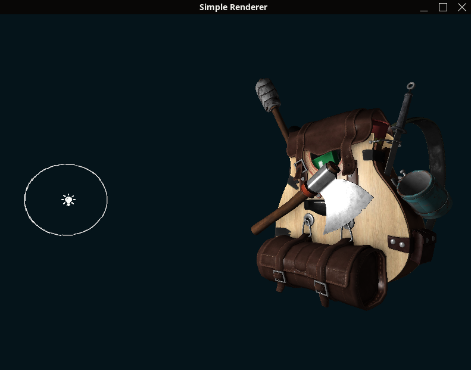

# SimpleRenderer

A minimal OpenGL renderer written in C++ using GLFW, OpenGL, and Assimp.


## Features

- OpenGL + GLFW window setup
- Assimp model loading
- Custom rendering pipeline

## Screenshot



## Build
```bash
cmake . && make && ./SimpleRenderer    # for linux
cmake . && make && SimpleRenderer.exe  # for windows
```